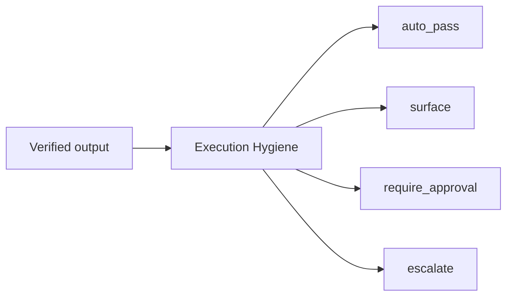

# Execution Hygiene Agent

**A reusable reduction layer between verified agent output and human attention.**

[](https://github.com/danyadotan/execution-hygiene-agent/actions/workflows/test.yml)
[](LICENSE)
[](CHANGELOG.md)

Execution Hygiene Agent is an open-source reference implementation of the **Hygiene** decision layer inside the TAB@Work execution-reliability loop.

It starts **after upstream verification**. Its job is not to decide whether an artifact is correct; its job is to decide what verified work should consume human attention, and what kind of human involvement is required.

**See the full execution-reliability loop in context:**  
https://tab-at-work.com

---

## The problem

AI can reduce production effort while increasing **review debt**.

If every generated artifact returns to a person for re-reading, comparison, approval, or cleanup, generation becomes faster while the human becomes the bottleneck.

Execution Hygiene separates four outcomes:

```text
auto_pass | surface | require_approval | escalate
```

The governing principle is:

> **Reduce human attention without reducing human authority.**

---

## Where it sits

```text
Harness
  ↓ evidence
Hygiene
  ↓ attention set
Human Judgment
  ↓ authorized decision
Governed Execution
  ↓
Verified Closure
```

**Harness produces evidence. Hygiene consumes evidence.**

This repository contains the Hygiene primitive only. It is **not** the full TAB@Work orchestration layer.

---

## Decision contract

The reference implementation accepts an artifact with a `changeType` and evaluates it against policy.

Decision precedence is intentionally conservative:

1. `require_approval` — explicit human authority is mandatory.
2. `escalate` — the available evidence or policy is insufficient to resolve safely.
3. `surface` — the item deserves human attention but does not itself require approval.
4. `auto_pass` — approved policy allows the item to avoid human re-reading.
5. Unknown change types fail safe to `escalate`.



### Invariants

- Required human approval can never be suppressed.
- Every decision returns a reason.
- Auto-passed items remain traceable.
- Unknown change types fail safe by escalating.
- Attention reduction never grants new authority.

---

## Quick start

Requirements: Node.js 20+.

```bash
git clone https://github.com/danyadotan/execution-hygiene-agent.git
cd execution-hygiene-agent
npm install
npm run demo
npm test
```

The included demo models one workflow in which **10 agents produce 10 client documents from one approved baseline**.

Expected result:

```text
10 artifacts received
8 auto-pass
1 surface
1 require approval
0 escalate

2 items reach the human attention layer.
Only 1 requires explicit human authority.
```

That is the same **10 → 8 → 2 → 1** reduction pattern used in the TAB@Work execution-reliability demo.

---

## Minimal usage

```ts
import { classify, type Policy } from "./src/hygiene.ts";

const policy: Policy = {
  autoPass: ["formatting_only"],
  surface: ["material_style_change"],
  requireHumanApproval: ["commercial_commitment"],
  escalate: ["missing_evidence"],
};

const result = classify(
  {
    id: "client-09",
    changeType: "commercial_commitment",
    change: "Added a 4-hour response-time commitment.",
  },
  policy
);

console.log(result);
// {
//   id: "client-09",
//   decision: "require_approval",
//   reason: "Policy requires explicit human authority for this change type.",
//   changeType: "commercial_commitment"
// }
```

---

## Repository structure

```text
src/
  hygiene.ts              core classification primitive
  index.ts                runnable demo

config/
  policy.json             example policy and invariants

examples/
  ten-documents/
    input.json             10-document demo input
    expected-output.json   expected reduction result

tests/
  hygiene.test.ts         safety + scenario tests

.github/workflows/
  test.yml                CI
```

---

## Policy example

`config/policy.json` separates change types by the type of intervention they require:

- **autoPass** — formatting, approved personalization, non-material style changes
- **surface** — material style changes, unusual changes, policy exceptions
- **requireHumanApproval** — commercial, legal, permission, or financial commitments
- **escalate** — missing evidence, conflicting policy, unresolved risk

This is a reference policy, not a universal one. Real deployments should define policy against their own authority model, risk boundaries, and source of truth.

---

## What this project is not

Execution Hygiene Agent is intentionally narrow.

It is not:

- a model-quality evaluator
- a source-of-truth system
- an autonomous approval system
- a replacement for human accountability
- the full TAB@Work orchestration architecture

The upstream system must determine that the work has been verified before it enters Hygiene. The downstream system must preserve authority boundaries and verify execution to closure.

---

## Related work

- **TAB@Work execution-reliability demo:** https://tab-at-work.com
- **TAB@Work demo repository:** https://github.com/danyadotan/tab-work-hygiene-demo

The broader loop evaluates whether agentic work preserves intent, respects authority, recovers safely, and reaches **verified closure** against a unified source of truth.

---

## Contributing

Contributions are welcome if they preserve the core invariants and keep the primitive implementation easy to inspect.

See [CONTRIBUTING.md](CONTRIBUTING.md).

---

## Version

Current reference release: **v0.1.0**

See [CHANGELOG.md](CHANGELOG.md).

---

## License

MIT © 2026 Danya Dotan. See [LICENSE](LICENSE).
